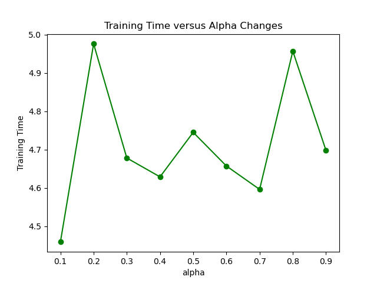

This project implements the Static Pre-Sampling and Dynamic Re-Sampling for Efficient Graph Learning Storage and Retrieval.


Result Analysis

setting 1:

```Python
presampled_nodes = 20
presampled_perexpansion = 2
resampled_nodes = 10
sampled_depth = 1
```


1. Test Loss versus Alpha Changes

   

2. Test Accuracy versus Alpha Changes

   

3. Training Time versus Alpha Changes

   

setting 2:

```Python
presampled_nodes = 20
presampled_perexpansion = 2
resampled_nodes = 10
sampled_depth = 3
```


1. Test Loss versus Alpha Changes

   

2. Test Accuracy versus Alpha Changes

   

3. Training Time versus Alpha Changes

   

   

setting 3:

```Python
presampled_nodes = 20
presampled_perexpansion = 2
resampled_nodes = 10
sampled_depth = 4
```


1. Test Loss versus Alpha Changes

   

2. Test Accuracy versus Alpha Changes

   

3. Training Time versus Alpha Changes

   

   