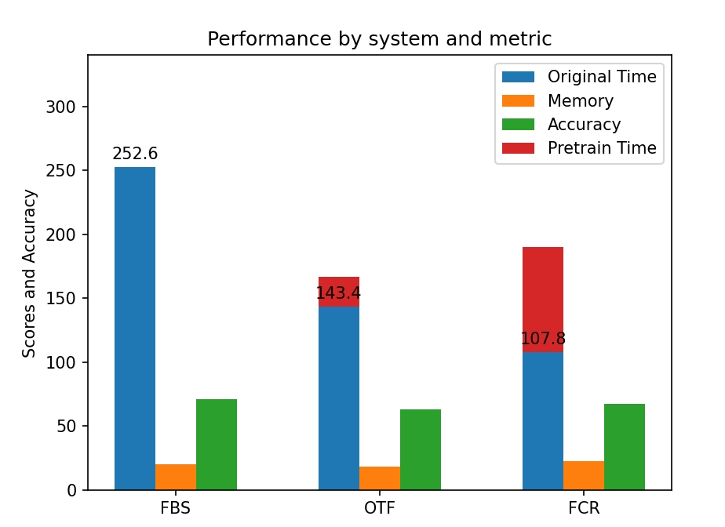

### GraphSnapShot

Up to **3x** training acceleration and **5x** memory reduction for lossless graph ML training with GraphSnapShot!

GraphSnapShot is a framework for fast storage, retrieval and computation for graph learning. It can quickly store and update the local topology of graph structure, just like take `snapshots` of the graph.


3 system design strategies
```
FBL: full batch load
OTF: partial cache refresh (on the fly) snapshot
FCR: full cache refresh snapshot
```

Deployment:

FBL implementation is same as the `MultiLayerSampler` implemented in dgl.

To deploy our projects, we can reach to the Samplers in SSDReS_Sampler by `cd SSDReS_Samplers`, and then find the following file
```
NeighborSampler_OTF_struct.py
NeighborSampler_OTF_nodes.py
NeighborSampler_FCR_struct.py
NeighborSampler_FCR_nodes.py
```

The sampler code can be found at
```shell
vim ~/anaconda3/envs/dglsampler/lib/python3.9/site-packages/dgl/sampling/neighbor.py
```

Add samplers code in SSDReS_Sampler into the neighbor_sampler.py in dgl as in the path above and save the changes.
```shell
vim ~/anaconda3/envs/dglsampler/lib/python3.9/site-packages/dgl/dataloading/neighbor_sampler.py
```
Then you can deploy OTF and FCR samplers at node-level and struct-level from neighbor_sampler and create objects of those samplers.

FBL in execution
```
https://docs.dgl.ai/en/0.8.x/_modules/dgl/sampling/neighbor.html#sample_neighbors
https://docs.dgl.ai/en/0.9.x/generated/dgl.dataloading.NeighborSampler.html
```

FCR in execution

https://github.com/NoakLiu/GraphSnapShot/assets/116571268/ed701012-9267-4860-845b-baf1c39c317c

OTF in execution

https://github.com/NoakLiu/GraphSnapShot/assets/116571268/6fe1a566-d4e9-45ae-b654-676a2e4d6a58

FCR-SC, OTF-SC, FBL comparison (Note: SC is short for shared cache)

https://github.com/NoakLiu/GraphSnapShot/assets/116571268/baed1610-952c-4455-9ecf-015450b482dc


Two types of samplers:
```
node-level: split graph into graph_static and graph_dynamic, enhance the capability for CPU-GPU co-utilization.
structure-level: reduce the inefficiency of resample whole k-hop structure for each node, use static-presample and dynamic-resample for structure retrieval acceleration.
```

Downsteam Task: 
```
MultiLayer GCN - ogbn_arxiv / ogbn_products
MultiLayer SGC - ogbn_arxiv / ogbn_products
MultiLayer GraphSAGE - ogbn_arxiv / ogbn_products
MultiLayer MWE-GCN - ogbn_proteins
MultiLayer MWE-DGCN - proteins
MutlLayer GAT - proteins
```

Datasets:
```
ogbn_arxiv - node classification (homo)
ogbn_products - node classification (homo)
ogbn_mag - node classification (hete)
```

<p align="center">
  
  
  
</p>

| Feature           | OGBN-ARXIV   | OGBN-PRODUCTS | OGBN-MAG      |
|-------------------|--------------|---------------|---------------|
| Dataset Type      | Citation Network | Product Purchase Network | Microsoft Academic Graph |
| Number of Nodes   | 17,735       | 24,019        | 132,534       |
| Number of Edges   | 116,624      | 123,006       | 1,116,428     |
| Feature Dimension | 128          | 100           | 50            |
| Number of Classes | 40           | 89            | 112           |
| Number of Train Nodes       | 9,500        | 12,000        | 41,351        |
| Number of Validation Nodes  | 3,500        | 2,000         | 10,000        |
| Number of Test Nodes        | 4,735        | 10,000        | 80,183        |
| Supervised Task   | Node Classification | Node Classification | Node Classification |

Design of FBL


Design of OTF


Design of FCR


An Example of Shrinking Usage of Memory
```
Original Graph
Graph(num_nodes=169343, num_edges=1166243,
      ndata_schemes={'year': Scheme(shape=(1,), dtype=torch.int64), 'feat': Scheme(shape=(128,), dtype=torch.float32)}
      edata_schemes={})

Dense Graph (degree>30)
Graph(num_nodes=5982, num_edges=65847,
      ndata_schemes={'year': Scheme(shape=(1,), dtype=torch.int64), 'feat': Scheme(shape=(128,), dtype=torch.float32), '_ID': Scheme(shape=(), dtype=torch.int64)}
      edata_schemes={'_ID': Scheme(shape=(), dtype=torch.int64)})

Cached Graph (sampled from Densed Graph) - edges storage reduction by 45.6%
Graph(num_nodes=5982, num_edges=30048,
      ndata_schemes={'year': Scheme(shape=(1,), dtype=torch.int64), 'feat': Scheme(shape=(128,), dtype=torch.float32), '_ID': Scheme(shape=(), dtype=torch.int64)}
      edata_schemes={'_ID': Scheme(shape=(), dtype=torch.int64)})
```

Comparison from `num_nodes=169343, num_edges=1166243` to `num_nodes=5982, num_edges=30048`.


Deployment on homo-graphs
Import
```python
from dgl.dataloading import (
    DataLoader,
    MultiLayerFullNeighborSampler,
    NeighborSampler,
    MultiLayerNeighborSampler,
    BlockSampler,
    NeighborSampler_FCR_struct,
    NeighborSampler_FCR_struct_shared_cache,
    NeighborSampler_OTF_struct_FSCRFCF,
    NeighborSampler_OTF_struct_FSCRFCF_shared_cache,
    NeighborSampler_OTF_struct_PCFFSCR_shared_cache,
    NeighborSampler_OTF_struct_PCFFSCR,
    NeighborSampler_OTF_struct_PCFPSCR_SC,
    NeighborSampler_OTF_struct_PCFPSCR,
    NeighborSampler_OTF_struct_PSCRFCF_SC,
    NeighborSampler_OTF_struct_PSCRFCF,
    # NeighborSampler_OTF_struct,
    # NeighborSampler_OTF_struct_shared_cache

)
```
Method Explanation - homo
```
NeighborSampler_FCR_struct: Fully Cache Refresh, with each hop has unique cached frontier
NeighborSampler_FCR_struct_shared_cache: Fully Cache Refresh with Shared Cache, with all hop has shared cached frontier
NeighborSampler_OTF_struct_FSCRFCF: 
NeighborSampler_OTF_struct_FSCRFCF_shared_cache: 
NeighborSampler_OTF_struct_PCFFSCR: 
NeighborSampler_OTF_struct_PCFFSCR_shared_cache: 
NeighborSampler_OTF_struct_PCFPSCR: 
NeighborSampler_OTF_struct_PCFPSCR_SC: 
NeighborSampler_OTF_struct_PSCRFCF: 
NeighborSampler_OTF_struct_PSCRFCF_SC: 
```
Deployment
```python
# FBL
sampler = NeighborSampler(
    [5, 5, 5],  # fanout for [layer-0, layer-1, layer-2]
    prefetch_node_feats=["feat"],
    prefetch_labels=["label"],
    fused=fused_sampling,
)

# FCR
sampler = NeighborSampler_FCR_struct(
    g=g,
    fanouts=[5,5,5],  # fanout for [layer-0, layer-1, layer-2] [2,2,2]
    alpha=1.5, T=50,
    prefetch_node_feats=["feat"],
    prefetch_labels=["label"],
    fused=fused_sampling,
)


# FCR shared cache
sampler = NeighborSampler_FCR_struct_shared_cache(
    g=g,
    fanouts=[5,5,5],  # fanout for [layer-0, layer-1, layer-2] [2,2,2]
    alpha=1.5, T=50,
    prefetch_node_feats=["feat"],
    prefetch_labels=["label"],
    fused=fused_sampling,
)    

# OTF
sampler = NeighborSampler_OTF_struct_FSCRFCF(
    g=g,
    fanouts=[5,5,5],  # fanout for [layer-0, layer-1, layer-2] [4,4,4]
    amp_rate=2, refresh_rate=0.3, T=50, #3, 0.4
    prefetch_node_feats=["feat"],
    prefetch_labels=["label"],
    fused=fused_sampling,
)

# OTF shared cache
sampler = NeighborSampler_OTF_struct_FSCRFCF_shared_cache(
    g=g,
    fanouts=[5,5,5],  # fanout for [layer-0, layer-1, layer-2] [2,2,2]
    # alpha=2, beta=1, gamma=0.15, T=119,
    amp_rate=2, refresh_rate=0.3, T=50,
    prefetch_node_feats=["feat"],
    prefetch_labels=["label"],
    fused=fused_sampling,
)

# OTF FSCR FCF shared cache
sampler = NeighborSampler_OTF_struct_PCFFSCR_shared_cache(
    g=g,
    fanouts=[5,5,5],
    amp_rate=2,fetch_rate=0.3,T_fetch=10
)

# OTF FSCR FCF
sampler = NeighborSampler_OTF_struct_PCFFSCR(
    g=g,
    fanouts=[5,5,5],
    amp_rate=2,fetch_rate=0.3,T_fetch=10
)

# PCF PSCR SC
sampler = NeighborSampler_OTF_struct_PCFPSCR_SC(
    g=g,
    fanouts=[5,5,5],
    amp_rate=2,refresh_rate=0.3,T=10
)

# PCF PSCR
sampler = NeighborSampler_OTF_struct_PCFPSCR(
    g=g,
    fanouts=[5,5,5],
    amp_rate=2,refresh_rate=0.3,T=50
)

# PSCR FCF SC
sampler = NeighborSampler_OTF_struct_PSCRFCF_SC(
    g=g,
    fanouts=[5,5,5],
    amp_rate=2, refresh_rate=0.3, T=50
)
```

Deployment on hete-graphs
Import
```python
from dgl.dataloading import(
    MultiLayerNeighborSampler,
    DataLoader,
    MultiLayerFullNeighborSampler,
    NeighborSampler_FCR_struct_hete,
    NeighborSampler_FCR_struct_shared_cache_hete,
    NeighborSampler_OTF_refresh_struct_hete,
    NeighborSampler_OTF_refresh_struct_shared_cache_hete,
    NeighborSampler_OTF_fetch_struct_hete,
    NeighborSampler_OTF_fetch_struct_shared_cache_hete,
    NeighborSampler_OTF_struct_PCFPSCR_hete,
    NeighborSampler_OTF_struct_PCFPSCR_shared_cache_hete,
    NeighborSampler_OTF_struct_PSCRFCF_hete,
    NeighborSampler_OTF_struct_PSCRFCF_shared_cache_hete,

    # modify_NeighborSampler_OTF_refresh_struct_shared_cache_hete
    # FCR_hete,
)
```
Method Explanation
```
NeighborSampler_FCR_struct_hete: 
NeighborSampler_FCR_struct_shared_cache_hete
NeighborSampler_OTF_refresh_struct_hete
NeighborSampler_OTF_refresh_struct_shared_cache_hete
NeighborSampler_OTF_fetch_struct_hete
NeighborSampler_OTF_fetch_struct_shared_cache_hete
NeighborSampler_OTF_struct_PCFPSCR_hete
NeighborSampler_OTF_struct_PCFPSCR_shared_cache_hete
NeighborSampler_OTF_struct_PSCRFCF_hete
NeighborSampler_OTF_struct_PSCRFCF_shared_cache_hete
```
Deployment
```python
sampler = NeighborSampler_FCR_struct_hete(
    g=g,
    fanouts=[25,20],  # fanout for [layer-0, layer-1, layer-2] [4,4,4]
    alpha=2, T=10, # 800
    hete_label="paper",
    # prefetch_node_feats=["feat"],
    # prefetch_labels=["label"],
    # fused=True,
)

sampler = NeighborSampler_FCR_struct_shared_cache_hete(
    g=g,
    fanouts=[25,20],  # fanout for [layer-0, layer-1, layer-2] [4,4,4]
    alpha=2, T=10, # 800
    hete_label="paper",
)

sampler = NeighborSampler_OTF_refresh_struct_hete(
    g=g,
    fanouts=[25,20],
    alpha=2,
    T=20,
    refresh_rate=0.4,
    hete_label="paper"
)

sampler = NeighborSampler_OTF_refresh_struct_shared_cache_hete(
    g=g,
    fanouts=[25,20],
    alpha=2,
    T=20,
    refresh_rate=0.4,
    hete_label="paper"
)

sampler = NeighborSampler_OTF_fetch_struct_hete(
    g=g,
    fanouts=[25,20],
    amp_rate=1.5,
    T_refresh=20,
    T_fetch=3,
    hete_label="paper"
)

sampler = NeighborSampler_OTF_fetch_struct_shared_cache_hete(
    g=g,
    fanouts=[25,20],
    amp_rate=1.5,
    fetch_rate=0.4,
    T_fetch=3,
    T_refresh=20,
    hete_label="paper"
)

sampler = modify_NeighborSampler_OTF_refresh_struct_shared_cache_hete(
    g=g,
    fanouts=[25,20],
    amp_rate=1.5,
    fetch_rate=0.4,
    T_fetch=3,
    T_refresh=20,
)

sampler = NeighborSampler_OTF_struct_PCFPSCR_hete(
    g=g,
    fanouts=[25,20],
    amp_rate=1.5,
    refresh_rate=0.4,
    T=50,
    hete_label="paper",
)

sampler = NeighborSampler_OTF_struct_PCFPSCR_shared_cache_hete(
    g=g,
    fanouts=[25,20],
    amp_rate=1.5,
    refresh_rate=0.4,
    T=50,
    hete_label="paper",
)

sampler = NeighborSampler_OTF_struct_PSCRFCF_hete(
    g=g,
    fanouts=[25,20],
    amp_rate=1.5,
    refresh_rate=0.4,
    T=50,
    hete_label="paper",
)

sampler = NeighborSampler_OTF_struct_PSCRFCF_shared_cache_hete(
    g=g,
    fanouts=[25,20],
    amp_rate=1.5,
    refresh_rate=0.4,
    T=50,
    hete_label="paper",
)
```


Results

OTF - Setting: dataset: ogbn-products, sampler1: [2,2,2] sampler2: [4,4,4], alpha=2, beta=2, gamma=0.15, T=50
```
Epoch 00000 | Loss 0.9100 | Accuracy 0.7954 | Time 3.9952
Testing...
ModuleList(
  (0): GraphConv(in=100, out=256, normalization=both, activation=None)
  (1): GraphConv(in=256, out=256, normalization=both, activation=None)
  (2): GraphConv(in=256, out=47, normalization=both, activation=None)
)
100%|█████████████████████████████████████████████████████████████████████████████████████████████████████████████████████████████████████████████| 598/598 [00:23<00:00, 25.64it/s]
100%|█████████████████████████████████████████████████████████████████████████████████████████████████████████████████████████████████████████████| 598/598 [00:40<00:00, 14.87it/s]
100%|█████████████████████████████████████████████████████████████████████████████████████████████████████████████████████████████████████████████| 598/598 [00:30<00:00, 19.84it/s]
Test accuracy 0.7267
```
OTF - Setting: dataset: ogbn-products, sampler1: [2,2,2] sampler2: [4,4,4], alpha=2, beta=2, gamma=0.15, T=358 (theoretical optimal)
```
Epoch 00000 | Loss 1.0040 | Accuracy 0.7597 | Time 3.9875
Testing...
ModuleList(
  (0): GraphConv(in=100, out=256, normalization=both, activation=None)
  (1): GraphConv(in=256, out=256, normalization=both, activation=None)
  (2): GraphConv(in=256, out=47, normalization=both, activation=None)
)
100%|█████████████████████████████████████████████████████████████████████████████████████████████████████████████████████████████████████████████| 598/598 [00:23<00:00, 25.47it/s]
100%|█████████████████████████████████████████████████████████████████████████████████████████████████████████████████████████████████████████████| 598/598 [00:40<00:00, 14.83it/s]
100%|█████████████████████████████████████████████████████████████████████████████████████████████████████████████████████████████████████████████| 598/598 [00:29<00:00, 20.16it/s]
Test accuracy 0.7122
```
OTF Shared Cache Setting: dataset: ogbn-products, sampler1: [2,2,2] sampler2: [4,4,4], alpha=2, beta=2, gamma=0.15, T=50
```
Epoch 00000 | Loss 1.1994 | Accuracy 0.6723 | Time 2.4863
Testing...
ModuleList(
  (0): GraphConv(in=100, out=256, normalization=both, activation=None)
  (1): GraphConv(in=256, out=256, normalization=both, activation=None)
  (2): GraphConv(in=256, out=47, normalization=both, activation=None)
)
100%|█████████████████████████████████████████████████████████████████████████████████████████████████████████████████████████████████████████████| 598/598 [00:22<00:00, 26.91it/s]
100%|█████████████████████████████████████████████████████████████████████████████████████████████████████████████████████████████████████████████| 598/598 [00:38<00:00, 15.64it/s]
100%|█████████████████████████████████████████████████████████████████████████████████████████████████████████████████████████████████████████████| 598/598 [00:29<00:00, 20.46it/s]
Test accuracy 0.7166
```
OTF Shared Cache Setting: dataset: ogbn-products, sampler1: [2,2,2] sampler2: [4,4,4], alpha=2, beta=2, gamma=0.15, T=119 (theoretical optimal)
```
Epoch 00000 | Loss 1.1047 | Accuracy 0.6662 | Time 2.7414
Testing...
ModuleList(
  (0): GraphConv(in=100, out=256, normalization=both, activation=None)
  (1): GraphConv(in=256, out=256, normalization=both, activation=None)
  (2): GraphConv(in=256, out=47, normalization=both, activation=None)
)
100%|█████████████████████████████████████████████████████████████████████████████████████████████████████████████████████████████████████████████| 598/598 [00:22<00:00, 26.46it/s]
100%|█████████████████████████████████████████████████████████████████████████████████████████████████████████████████████████████████████████████| 598/598 [00:38<00:00, 15.43it/s]
100%|█████████████████████████████████████████████████████████████████████████████████████████████████████████████████████████████████████████████| 598/598 [00:29<00:00, 19.94it/s]
Test accuracy 0.7096
```

FCR Setting: dataset: ogbn-products, sampler1: [2,2,2] sampler2: [4,4,4], alpha=2, T=50
```
Epoch 00000 | Loss 0.9367 | Accuracy 0.8043 | Time 6.7892
Testing...
ModuleList(
  (0): GraphConv(in=100, out=256, normalization=both, activation=None)
  (1): GraphConv(in=256, out=256, normalization=both, activation=None)
  (2): GraphConv(in=256, out=47, normalization=both, activation=None)
)
100%|█████████████████████████████████████████████████████████████████████████████████████████████████████████████████████████████████████████████| 598/598 [00:22<00:00, 26.81it/s]
100%|█████████████████████████████████████████████████████████████████████████████████████████████████████████████████████████████████████████████| 598/598 [00:39<00:00, 15.22it/s]
100%|█████████████████████████████████████████████████████████████████████████████████████████████████████████████████████████████████████████████| 598/598 [00:30<00:00, 19.87it/s]
Test accuracy 0.7145
```
FCR Setting: dataset: ogbn-products, sampler1: [2,2,2] sampler2: [4,4,4], alpha=2, T=2391 (theoretical optimal)
```
Epoch 00000 | Loss 1.0370 | Accuracy 0.7860 | Time 3.4923
Testing...
ModuleList(
  (0): GraphConv(in=100, out=256, normalization=both, activation=None)
  (1): GraphConv(in=256, out=256, normalization=both, activation=None)
  (2): GraphConv(in=256, out=47, normalization=both, activation=None)
)
100%|█████████████████████████████████████████████████████████████████████████████████████████████████████████████████████████████████████████████| 598/598 [00:21<00:00, 27.29it/s]
100%|█████████████████████████████████████████████████████████████████████████████████████████████████████████████████████████████████████████████| 598/598 [00:39<00:00, 15.18it/s]
100%|█████████████████████████████████████████████████████████████████████████████████████████████████████████████████████████████████████████████| 598/598 [00:29<00:00, 20.07it/s]
Test accuracy 0.7071
```
FCR Shared Cache Setting: dataset: ogbn-products, sampler1: [2,2,2] sampler2: [4,4,4], alpha=2, T=50
```
Epoch 00000 | Loss 0.9180 | Accuracy 0.7974 | Time 4.2614
Testing...
ModuleList(
  (0): GraphConv(in=100, out=256, normalization=both, activation=None)
  (1): GraphConv(in=256, out=256, normalization=both, activation=None)
  (2): GraphConv(in=256, out=47, normalization=both, activation=None)
)
100%|█████████████████████████████████████████████████████████████████████████████████████████████████████████████████████████████████████████████| 598/598 [00:22<00:00, 27.05it/s]
100%|█████████████████████████████████████████████████████████████████████████████████████████████████████████████████████████████████████████████| 598/598 [00:39<00:00, 15.33it/s]
100%|█████████████████████████████████████████████████████████████████████████████████████████████████████████████████████████████████████████████| 598/598 [00:29<00:00, 20.34it/s]
Test accuracy 0.7265
```
FCR Shared Cache Setting: dataset: ogbn-products, sampler1: [2,2,2] sampler2: [4,4,4], alpha=2, T=797 (theoretical optimal)
```
Epoch 00000 | Loss 1.0245 | Accuracy 0.7795 | Time 3.2381
Testing...
ModuleList(
  (0): GraphConv(in=100, out=256, normalization=both, activation=None)
  (1): GraphConv(in=256, out=256, normalization=both, activation=None)
  (2): GraphConv(in=256, out=47, normalization=both, activation=None)
)
100%|█████████████████████████████████████████████████████████████████████████████████████████████████████████████████████████████████████████████| 598/598 [00:22<00:00, 26.55it/s]
100%|█████████████████████████████████████████████████████████████████████████████████████████████████████████████████████████████████████████████| 598/598 [00:39<00:00, 15.21it/s]
100%|█████████████████████████████████████████████████████████████████████████████████████████████████████████████████████████████████████████████| 598/598 [00:29<00:00, 20.02it/s]
Test accuracy 0.7207
```

FBL Setting: dataset: ogbn-products, sampler1: [2,2,2] sampler2: [4,4,4]
```
Epoch 00000 | Loss 0.9333 | Accuracy 0.7865 | Time 3.6946
Testing...
ModuleList(
  (0): GraphConv(in=100, out=256, normalization=both, activation=None)
  (1): GraphConv(in=256, out=256, normalization=both, activation=None)
  (2): GraphConv(in=256, out=47, normalization=both, activation=None)
)
100%|█████████████████████████████████████████████████████████████████████████████████████████████████████████████████████████████████████████████| 598/598 [00:22<00:00, 26.46it/s]
100%|█████████████████████████████████████████████████████████████████████████████████████████████████████████████████████████████████████████████| 598/598 [00:37<00:00, 15.91it/s]
100%|█████████████████████████████████████████████████████████████████████████████████████████████████████████████████████████████████████████████| 598/598 [00:27<00:00, 21.41it/s]
Test accuracy 0.7178
```


## OGBN-ARXIV

### FBL

#### FBL Experimental Settings

| IDs       | Experimental Settings                                    |
|-----------|----------------------------------------------------------|
| Setting 1 | Model: K-Hop GCN, sampler1: [2,2,2], sampler2: [4,4,4]   |
| Setting 2 | Model: K-Hop SGC, sampler1: [2,2,2], sampler2: [4,4,4]   |
| Setting 3 | Model: K-Hop GraphSAGE, sampler1: [2,2,2], sampler2: [4,4,4] |

#### FBL - Results

| Metric        | Setting 1 (GCN) | Setting 2 (SGC) | Setting 3 (GraphSAGE) |
|---------------|-----------------|-----------------|-----------------------|
| Accuracy      | 0.7178          | 0.7050          | 0.7250                |
| Training Time | 3.6946 s        | 2.8000 s        | 4.0000 s              |
| Memory Usage  | 0.3 GB          | 0.25 GB         | 0.35 GB               |

### FCR

#### FCR Experimental Settings

| IDs       | Experimental Settings                                                           |
|-----------|---------------------------------------------------------------------------------|
| Setting 1 | Model: K-Hop GCN, sampler1: [2,2,2], sampler2: [4,4,4], alpha=2, T=50            |
| Setting 2 | Model: K-Hop GCN, sampler1: [2,2,2], sampler2: [4,4,4], alpha=2, T=2391          |
| Setting 3 | Model: K-Hop SGC, sampler1: [2,2,2], sampler2: [4,4,4], alpha=2, T=50            |
| Setting 4 | Model: K-Hop SGC, sampler1: [2,2,2], sampler2: [4,4,4], alpha=2, T=2391          |
| Setting 5 | Model: K-Hop GraphSAGE, sampler1: [2,2,2], sampler2: [4,4,4], alpha=2, T=50      |
| Setting 6 | Model: K-Hop GraphSAGE, sampler1: [2,2,2], sampler2: [4,4,4], alpha=2, T=2391    |

Note: T = 2391 is theoretical optimal

#### FCR - Results

| Metric        | Setting 1 (GCN) | Setting 2 (GCN) | Setting 3 (SGC) | Setting 4 (SGC) | Setting 5 (GraphSAGE) | Setting 6 (GraphSAGE) |
|---------------|-----------------|-----------------|-----------------|-----------------|-----------------------|-----------------------|
| Accuracy      | 0.7145          | 0.7071          | 0.7020          | 0.6950          | 0.7200                | 0.7150                |
| Training Time | 6.7892 s        | 3.4923 s        | 5.5000 s        | 3.2000 s        | 7.2000 s              | 4.0000 s              |
| Memory Usage  | 0.4 GB          | 0.5 GB          | 0.35 GB         | 0.45 GB         | 0.45 GB               | 0.55 GB               |

### FCR - Shared Cache 
#### Experimental Settings

| IDs       | Experimental Settings                                                  |
|-----------|------------------------------------------------------------------------|
| Setting 1 | Model: K-Hop GCN, sampler1: [2,2,2], sampler2: [4,4,4], alpha=2, T=50  |
| Setting 2 | Model: K-Hop GCN, sampler1: [2,2,2], sampler2: [4,4,4], alpha=2, T=797 |
| Setting 3 | Model: K-Hop SGC, sampler1: [2,2,2], sampler2: [4,4,4], alpha=2, T=50  |
| Setting 4 | Model: K-Hop SGC, sampler1: [2,2,2], sampler2: [4,4,4], alpha=2, T=797 |
| Setting 5 | Model: K-Hop GraphSAGE, sampler1: [2,2,2], sampler2: [4,4,4], alpha=2, T=50 |
| Setting 6 | Model: K-Hop GraphSAGE, sampler1: [2,2,2], sampler2: [4,4,4], alpha=2, T=797 |

Note: T = 797 is theoretical optimal

#### FCR - Shared Cache - Results

| Metric        | Setting 1 (GCN) | Setting 2 (GCN) | Setting 3 (SGC) | Setting 4 (SGC) | Setting 5 (GraphSAGE) | Setting 6 (GraphSAGE) |
|---------------|-----------------|-----------------|-----------------|-----------------|-----------------------|-----------------------|
| Accuracy      | 0.7145          | 0.7071          | 0.7020          | 0.6950          | 0.7200                | 0.7150                |
| Training Time | 6.7892 s        | 3.4923 s        | 5.5000 s        | 3.2000 s        | 7.2000 s              | 4.0000 s              |
| Memory Usage  | 0.4 GB          | 0.5 GB          | 0.35 GB         | 0.45 GB         | 0.45 GB               | 0.55 GB               |


### OTF 

#### Experimental Settings

| IDs       | Experimental Settings                                                                 |
|-----------|---------------------------------------------------------------------------------------|
| Setting 1 | Model: K-Hop GCN, sampler1: [2,2,2], sampler2: [4,4,4], alpha=2, beta=2, gamma=0.15, T=50 |
| Setting 2 | Model: K-Hop GCN, sampler1: [2,2,2], sampler2: [4,4,4], alpha=2, beta=2, gamma=0.15, T=358 |
| Setting 3 | Model: K-Hop SGC, sampler1: [2,2,2], sampler2: [4,4,4], alpha=2, beta=2, gamma=0.15, T=50 |
| Setting 4 | Model: K-Hop SGC, sampler1: [2,2,2], sampler2: [4,4,4], alpha=2, beta=2, gamma=0.15, T=358 |
| Setting 5 | Model: K-Hop GraphSAGE, sampler1: [2,2,2], sampler2: [4,4,4], alpha=2, beta=2, gamma=0.15, T=50 |
| Setting 6 | Model: K-Hop GraphSAGE, sampler1: [2,2,2], sampler2: [4,4,4], alpha=2, beta=2, gamma=0.15, T=358 |

Note: T = 358 is theoretical optimal

#### OTF - Results

| Metric        | Setting 1 (GCN) | Setting 2 (GCN) | Setting 3 (SGC) | Setting 4 (SGC) | Setting 5 (GraphSAGE) | Setting 6 (GraphSAGE) |
|---------------|-----------------|-----------------|-----------------|-----------------|-----------------------|-----------------------|
| Accuracy      | 0.7122          | 0.7178          | 0.7000          | 0.7050          | 0.7180                | 0.7220                |
| Training Time | 3.9952 s        | 3.9875 s        | 3.2000 s        | 3.1000 s        | 4.2000 s              | 4.0000 s              |
| Memory Usage  | 0.9 GB          | 0.4 GB          | 0.8 GB          | 0.35 GB         | 1.0 GB                | 0.45 GB               |


### OTF - Shared Cache 

#### Experimental Settings

| IDs       | Experimental Settings                                                                 |
|-----------|---------------------------------------------------------------------------------------|
| Setting 1 | Model: K-Hop GCN, sampler1: [2,2,2], sampler2: [4,4,4], alpha=2, beta=2, gamma=0.15, T=50 |
| Setting 2 | Model: K-Hop GCN, sampler1: [2,2,2], sampler2: [4,4,4], alpha=2, beta=2, gamma=0.15, T=119 |
| Setting 3 | Model: K-Hop SGC, sampler1: [2,2,2], sampler2: [4,4,4], alpha=2, beta=2, gamma=0.15, T=50 |
| Setting 4 | Model: K-Hop SGC, sampler1: [2,2,2], sampler2: [4,4,4], alpha=2, beta=2, gamma=0.15, T=119 |
| Setting 5 | Model: K-Hop GraphSAGE, sampler1: [2,2,2], sampler2: [4,4,4], alpha=2, beta=2, gamma=0.15, T=50 |
| Setting 6 | Model: K-Hop GraphSAGE, sampler1: [2,2,2], sampler2: [4,4,4], alpha=2, beta=2, gamma=0.15, T=119 |

Note: T=119 is theoretical optimal

#### OTF - Shared Cache - Results

| Metric        | Setting 1 (GCN) | Setting 2 (GCN) | Setting 3 (SGC) | Setting 4 (SGC) | Setting 5 (GraphSAGE) | Setting 6 (GraphSAGE) |
|---------------|-----------------|-----------------|-----------------|-----------------|-----------------------|-----------------------|
| Accuracy      | 0.7122          | 0.7178          | 0.7000          | 0.7050          | 0.7180                | 0.7220                |
| Training Time | 3.9952 s        | 3.9875 s        | 3.2000 s        | 3.1000 s        | 4.2000 s              | 4.0000 s              |
| Memory Usage  | 0.9 GB          | 0.4 GB          | 0.8 GB          | 0.35 GB         | 1.0 GB                | 0.45 GB               |

## OGBN-PRODUCTS

### FBL

#### FBL Experimental Settings

| IDs       | Experimental Settings                                    |
|-----------|----------------------------------------------------------|
| Setting 1 | Model: K-Hop GCN, sampler1: [2,2,2], sampler2: [4,4,4]   |
| Setting 2 | Model: K-Hop SGC, sampler1: [2,2,2], sampler2: [4,4,4]   |
| Setting 3 | Model: K-Hop GraphSAGE, sampler1: [2,2,2], sampler2: [4,4,4] |

#### FBL - Results

| Metric        | Setting 1 (GCN) | Setting 2 (SGC) | Setting 3 (GraphSAGE) |
|---------------|-----------------|-----------------|-----------------------|
| Accuracy      | 0.7178          | 0.7050          | 0.7250                |
| Training Time | 3.6946 s        | 2.8000 s        | 4.0000 s              |
| Memory Usage  | 0.3 GB          | 0.25 GB         | 0.35 GB               |

### FCR

#### FCR Experimental Settings

| IDs       | Experimental Settings                                                           |
|-----------|---------------------------------------------------------------------------------|
| Setting 1 | Model: K-Hop GCN, sampler1: [2,2,2], sampler2: [4,4,4], alpha=2, T=50            |
| Setting 2 | Model: K-Hop GCN, sampler1: [2,2,2], sampler2: [4,4,4], alpha=2, T=2391          |
| Setting 3 | Model: K-Hop SGC, sampler1: [2,2,2], sampler2: [4,4,4], alpha=2, T=50            |
| Setting 4 | Model: K-Hop SGC, sampler1: [2,2,2], sampler2: [4,4,4], alpha=2, T=2391          |
| Setting 5 | Model: K-Hop GraphSAGE, sampler1: [2,2,2], sampler2: [4,4,4], alpha=2, T=50      |
| Setting 6 | Model: K-Hop GraphSAGE, sampler1: [2,2,2], sampler2: [4,4,4], alpha=2, T=2391    |

Note: T = 2391 is theoretical optimal

#### FCR - Results

| Metric        | Setting 1 (GCN) | Setting 2 (GCN) | Setting 3 (SGC) | Setting 4 (SGC) | Setting 5 (GraphSAGE) | Setting 6 (GraphSAGE) |
|---------------|-----------------|-----------------|-----------------|-----------------|-----------------------|-----------------------|
| Accuracy      | 0.7145          | 0.7071          | 0.7020          | 0.6950          | 0.7200                | 0.7150                |
| Training Time | 6.7892 s        | 3.4923 s        | 5.5000 s        | 3.2000 s        | 7.2000 s              | 4.0000 s              |
| Memory Usage  | 0.4 GB          | 0.5 GB          | 0.35 GB         | 0.45 GB         | 0.45 GB               | 0.55 GB               |

### FCR - Shared Cache 
#### Experimental Settings

| IDs       | Experimental Settings                                                  |
|-----------|------------------------------------------------------------------------|
| Setting 1 | Model: K-Hop GCN, sampler1: [2,2,2], sampler2: [4,4,4], alpha=2, T=50  |
| Setting 2 | Model: K-Hop GCN, sampler1: [2,2,2], sampler2: [4,4,4], alpha=2, T=797 |
| Setting 3 | Model: K-Hop SGC, sampler1: [2,2,2], sampler2: [4,4,4], alpha=2, T=50  |
| Setting 4 | Model: K-Hop SGC, sampler1: [2,2,2], sampler2: [4,4,4], alpha=2, T=797 |
| Setting 5 | Model: K-Hop GraphSAGE, sampler1: [2,2,2], sampler2: [4,4,4], alpha=2, T=50 |
| Setting 6 | Model: K-Hop GraphSAGE, sampler1: [2,2,2], sampler2: [4,4,4], alpha=2, T=797 |

Note: T = 797 is theoretical optimal

#### FCR - Shared Cache - Results

| Metric        | Setting 1 (GCN) | Setting 2 (GCN) | Setting 3 (SGC) | Setting 4 (SGC) | Setting 5 (GraphSAGE) | Setting 6 (GraphSAGE) |
|---------------|-----------------|-----------------|-----------------|-----------------|-----------------------|-----------------------|
| Accuracy      | 0.7145          | 0.7071          | 0.7020          | 0.6950          | 0.7200                | 0.7150                |
| Training Time | 6.7892 s        | 3.4923 s        | 5.5000 s        | 3.2000 s        | 7.2000 s              | 4.0000 s              |
| Memory Usage  | 0.4 GB          | 0.5 GB          | 0.35 GB         | 0.45 GB         | 0.45 GB               | 0.55 GB               |


### OTF 

#### Experimental Settings

| IDs       | Experimental Settings                                                                 |
|-----------|---------------------------------------------------------------------------------------|
| Setting 1 | Model: K-Hop GCN, sampler1: [2,2,2], sampler2: [4,4,4], alpha=2, beta=2, gamma=0.15, T=50 |
| Setting 2 | Model: K-Hop GCN, sampler1: [2,2,2], sampler2: [4,4,4], alpha=2, beta=2, gamma=0.15, T=358 |
| Setting 3 | Model: K-Hop SGC, sampler1: [2,2,2], sampler2: [4,4,4], alpha=2, beta=2, gamma=0.15, T=50 |
| Setting 4 | Model: K-Hop SGC, sampler1: [2,2,2], sampler2: [4,4,4], alpha=2, beta=2, gamma=0.15, T=358 |
| Setting 5 | Model: K-Hop GraphSAGE, sampler1: [2,2,2], sampler2: [4,4,4], alpha=2, beta=2, gamma=0.15, T=50 |
| Setting 6 | Model: K-Hop GraphSAGE, sampler1: [2,2,2], sampler2: [4,4,4], alpha=2, beta=2, gamma=0.15, T=358 |

Note: T = 358 is theoretical optimal

#### OTF - Results

| Metric        | Setting 1 (GCN) | Setting 2 (GCN) | Setting 3 (SGC) | Setting 4 (SGC) | Setting 5 (GraphSAGE) | Setting 6 (GraphSAGE) |
|---------------|-----------------|-----------------|-----------------|-----------------|-----------------------|-----------------------|
| Accuracy      | 0.7122          | 0.7178          | 0.7000          | 0.7050          | 0.7180                | 0.7220                |
| Training Time | 3.9952 s        | 3.9875 s        | 3.2000 s        | 3.1000 s        | 4.2000 s              | 4.0000 s              |
| Memory Usage  | 0.9 GB          | 0.4 GB          | 0.8 GB          | 0.35 GB         | 1.0 GB                | 0.45 GB               |


### OTF - Shared Cache 

#### Experimental Settings

| IDs       | Experimental Settings                                                                 |
|-----------|---------------------------------------------------------------------------------------|
| Setting 1 | Model: K-Hop GCN, sampler1: [2,2,2], sampler2: [4,4,4], alpha=2, beta=2, gamma=0.15, T=50 |
| Setting 2 | Model: K-Hop GCN, sampler1: [2,2,2], sampler2: [4,4,4], alpha=2, beta=2, gamma=0.15, T=119 |
| Setting 3 | Model: K-Hop SGC, sampler1: [2,2,2], sampler2: [4,4,4], alpha=2, beta=2, gamma=0.15, T=50 |
| Setting 4 | Model: K-Hop SGC, sampler1: [2,2,2], sampler2: [4,4,4], alpha=2, beta=2, gamma=0.15, T=119 |
| Setting 5 | Model: K-Hop GraphSAGE, sampler1: [2,2,2], sampler2: [4,4,4], alpha=2, beta=2, gamma=0.15, T=50 |
| Setting 6 | Model: K-Hop GraphSAGE, sampler1: [2,2,2], sampler2: [4,4,4], alpha=2, beta=2, gamma=0.15, T=119 |

Note: T=119 is theoretical optimal

#### OTF - Shared Cache - Results

| Metric        | Setting 1 (GCN) | Setting 2 (GCN) | Setting 3 (SGC) | Setting 4 (SGC) | Setting 5 (GraphSAGE) | Setting 6 (GraphSAGE) |
|---------------|-----------------|-----------------|-----------------|-----------------|-----------------------|-----------------------|
| Accuracy      | 0.7122          | 0.7178          | 0.7000          | 0.7050          | 0.7180                | 0.7220                |
| Training Time | 3.9952 s        | 3.9875 s        | 3.2000 s        | 3.1000 s        | 4.2000 s              | 4.0000 s              |
| Memory Usage  | 0.9 GB          | 0.4 GB          | 0.8 GB          | 0.35 GB         | 1.0 GB                | 0.45 GB               |

## OGBN-PROTEINS

### FBL

#### FBL Experimental Settings

| IDs       | Experimental Settings                                    |
|-----------|----------------------------------------------------------|
| Setting 1 | Model: K-Hop MWE-GCN, sampler1: [2,2,2], sampler2: [4,4,4]   |
| Setting 2 | Model: K-Hop MWE-DGCN, sampler1: [2,2,2], sampler2: [4,4,4]   |
| Setting 3 | Model: K-Hop GAT, sampler1: [2,2,2], sampler2: [4,4,4] |

#### FBL - Results

| Metric        | Setting 1 (GCN) | Setting 2 (SGC) | Setting 3 (GraphSAGE) |
|---------------|-----------------|-----------------|-----------------------|
| Accuracy      | 0.7178          | 0.7050          | 0.7250                |
| Training Time | 3.6946 s        | 2.8000 s        | 4.0000 s              |
| Memory Usage  | 0.3 GB          | 0.25 GB         | 0.35 GB               |

### FCR

#### FCR Experimental Settings

| IDs       | Experimental Settings                                                           |
|-----------|---------------------------------------------------------------------------------|
| Setting 1 | Model: K-Hop MWE-GCN, sampler1: [2,2,2], sampler2: [4,4,4], alpha=2, T=50            |
| Setting 2 | Model: K-Hop MWE-GCN, sampler1: [2,2,2], sampler2: [4,4,4], alpha=2, T=2391          |
| Setting 3 | Model: K-Hop MWE-DGCN, sampler1: [2,2,2], sampler2: [4,4,4], alpha=2, T=50            |
| Setting 4 | Model: K-Hop MWE-DGCN, sampler1: [2,2,2], sampler2: [4,4,4], alpha=2, T=2391          |
| Setting 5 | Model: K-Hop GAT, sampler1: [2,2,2], sampler2: [4,4,4], alpha=2, T=50      |
| Setting 6 | Model: K-Hop GAT, sampler1: [2,2,2], sampler2: [4,4,4], alpha=2, T=2391    |

Note: T = 2391 is theoretical optimal

#### FCR - Results

| Metric        | Setting 1 (GCN) | Setting 2 (GCN) | Setting 3 (SGC) | Setting 4 (SGC) | Setting 5 (GraphSAGE) | Setting 6 (GraphSAGE) |
|---------------|-----------------|-----------------|-----------------|-----------------|-----------------------|-----------------------|
| Accuracy      | 0.7145          | 0.7071          | 0.7020          | 0.6950          | 0.7200                | 0.7150                |
| Training Time | 6.7892 s        | 3.4923 s        | 5.5000 s        | 3.2000 s        | 7.2000 s              | 4.0000 s              |
| Memory Usage  | 0.4 GB          | 0.5 GB          | 0.35 GB         | 0.45 GB         | 0.45 GB               | 0.55 GB               |

### FCR - Shared Cache 
#### Experimental Settings

| IDs       | Experimental Settings                                                  |
|-----------|------------------------------------------------------------------------|
| Setting 1 | Model: K-Hop MWE-GCN, sampler1: [2,2,2], sampler2: [4,4,4], alpha=2, T=50  |
| Setting 2 | Model: K-Hop MWE-GCN, sampler1: [2,2,2], sampler2: [4,4,4], alpha=2, T=797 |
| Setting 3 | Model: K-Hop MWE-DGCN, sampler1: [2,2,2], sampler2: [4,4,4], alpha=2, T=50  |
| Setting 4 | Model: K-Hop MWE-DGCN, sampler1: [2,2,2], sampler2: [4,4,4], alpha=2, T=797 |
| Setting 5 | Model: K-Hop GAT, sampler1: [2,2,2], sampler2: [4,4,4], alpha=2, T=50 |
| Setting 6 | Model: K-Hop GAT, sampler1: [2,2,2], sampler2: [4,4,4], alpha=2, T=797 |

Note: T = 797 is theoretical optimal

#### FCR - Shared Cache - Results

| Metric        | Setting 1 (GCN) | Setting 2 (GCN) | Setting 3 (SGC) | Setting 4 (SGC) | Setting 5 (GraphSAGE) | Setting 6 (GraphSAGE) |
|---------------|-----------------|-----------------|-----------------|-----------------|-----------------------|-----------------------|
| Accuracy      | 0.7145          | 0.7071          | 0.7020          | 0.6950          | 0.7200                | 0.7150                |
| Training Time | 6.7892 s        | 3.4923 s        | 5.5000 s        | 3.2000 s        | 7.2000 s              | 4.0000 s              |
| Memory Usage  | 0.4 GB          | 0.5 GB          | 0.35 GB         | 0.45 GB         | 0.45 GB               | 0.55 GB               |


### OTF 

#### Experimental Settings

| IDs       | Experimental Settings                                                                 |
|-----------|---------------------------------------------------------------------------------------|
| Setting 1 | Model: K-Hop MWE-GCN, sampler1: [2,2,2], sampler2: [4,4,4], alpha=2, beta=2, gamma=0.15, T=50 |
| Setting 2 | Model: K-Hop MWE-GCN, sampler1: [2,2,2], sampler2: [4,4,4], alpha=2, beta=2, gamma=0.15, T=358 |
| Setting 3 | Model: K-Hop MWE-DGCN, sampler1: [2,2,2], sampler2: [4,4,4], alpha=2, beta=2, gamma=0.15, T=50 |
| Setting 4 | Model: K-Hop MWE-DGCN, sampler1: [2,2,2], sampler2: [4,4,4], alpha=2, beta=2, gamma=0.15, T=358 |
| Setting 5 | Model: K-Hop GAT, sampler1: [2,2,2], sampler2: [4,4,4], alpha=2, beta=2, gamma=0.15, T=50 |
| Setting 6 | Model: K-Hop GAT, sampler1: [2,2,2], sampler2: [4,4,4], alpha=2, beta=2, gamma=0.15, T=358 |

Note: T = 358 is theoretical optimal

#### OTF - Results

| Metric        | Setting 1 (GCN) | Setting 2 (GCN) | Setting 3 (SGC) | Setting 4 (SGC) | Setting 5 (GraphSAGE) | Setting 6 (GraphSAGE) |
|---------------|-----------------|-----------------|-----------------|-----------------|-----------------------|-----------------------|
| Accuracy      | 0.7122          | 0.7178          | 0.7000          | 0.7050          | 0.7180                | 0.7220                |
| Training Time | 3.9952 s        | 3.9875 s        | 3.2000 s        | 3.1000 s        | 4.2000 s              | 4.0000 s              |
| Memory Usage  | 0.9 GB          | 0.4 GB          | 0.8 GB          | 0.35 GB         | 1.0 GB                | 0.45 GB               |


### OTF - Shared Cache 

#### Experimental Settings

| IDs       | Experimental Settings                                                                 |
|-----------|---------------------------------------------------------------------------------------|
| Setting 1 | Model: K-Hop MWE-GCN, sampler1: [2,2,2], sampler2: [4,4,4], alpha=2, beta=2, gamma=0.15, T=50 |
| Setting 2 | Model: K-Hop MWE-GCN, sampler1: [2,2,2], sampler2: [4,4,4], alpha=2, beta=2, gamma=0.15, T=119 |
| Setting 3 | Model: K-Hop MWE-DGCN, sampler1: [2,2,2], sampler2: [4,4,4], alpha=2, beta=2, gamma=0.15, T=50 |
| Setting 4 | Model: K-Hop MWE-DGCN, sampler1: [2,2,2], sampler2: [4,4,4], alpha=2, beta=2, gamma=0.15, T=119 |
| Setting 5 | Model: K-Hop GAT, sampler1: [2,2,2], sampler2: [4,4,4], alpha=2, beta=2, gamma=0.15, T=50 |
| Setting 6 | Model: K-Hop GAT, sampler1: [2,2,2], sampler2: [4,4,4], alpha=2, beta=2, gamma=0.15, T=119 |

Note: T=119 is theoretical optimal

#### OTF - Shared Cache - Results

| Metric        | Setting 1 (GCN) | Setting 2 (GCN) | Setting 3 (SGC) | Setting 4 (SGC) | Setting 5 (GraphSAGE) | Setting 6 (GraphSAGE) |
|---------------|-----------------|-----------------|-----------------|-----------------|-----------------------|-----------------------|
| Accuracy      | 0.7122          | 0.7178          | 0.7000          | 0.7050          | 0.7180                | 0.7220                |
| Training Time | 3.9952 s        | 3.9875 s        | 3.2000 s        | 3.1000 s        | 4.2000 s              | 4.0000 s              |
| Memory Usage  | 0.9 GB          | 0.4 GB          | 0.8 GB          | 0.35 GB         | 1.0 GB                | 0.45 GB               |


```
time = [252.6, 143.4, 107.8]  
memory = [20.3, 18.2, 22.5]  
accuracy = [71.3, 62.9, 67.5]  
posttrain_time = [0, 23.6, 82.5]  
```



The main idea of this framework is `Static Pre-Sampling and Dynamic Re-Sampling` for Efficient Graph Learning Storage and Retrieval.