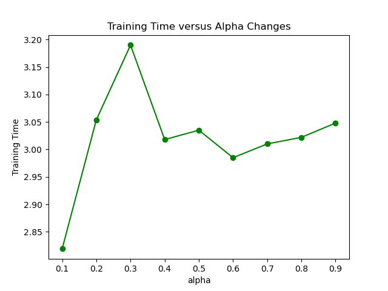

This project implements the Static Pre-Sampling and Dynamic Re-Sampling for Efficient Graph Learning Storage and Retrieval.

Result Analysis

1. Test Loss versus Alpha Changes

   

2. Test Accuracy versus Alpha Changes

   

3. Training Time versus Alpha Changes

   
