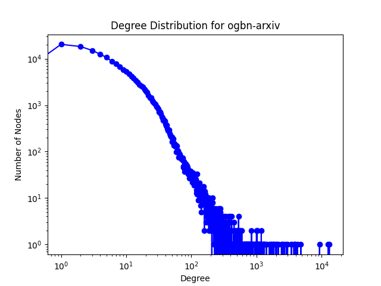
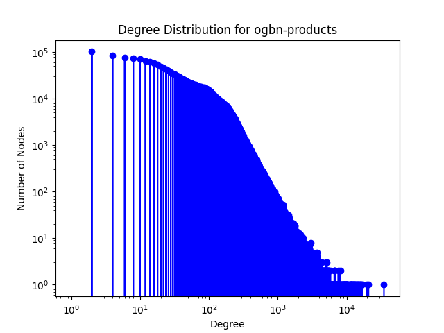
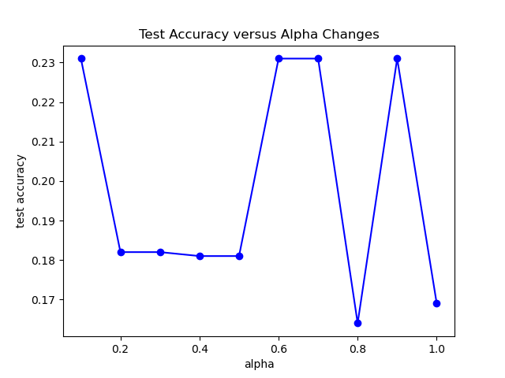
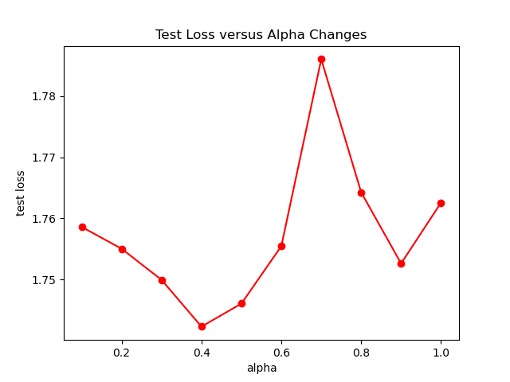
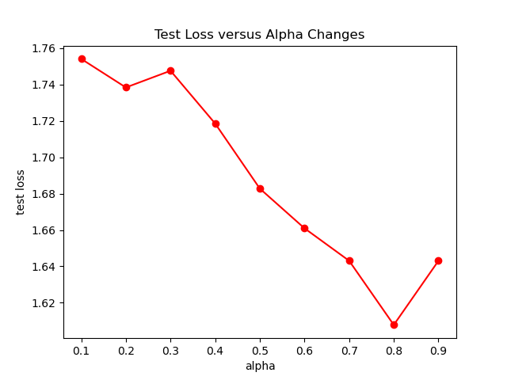
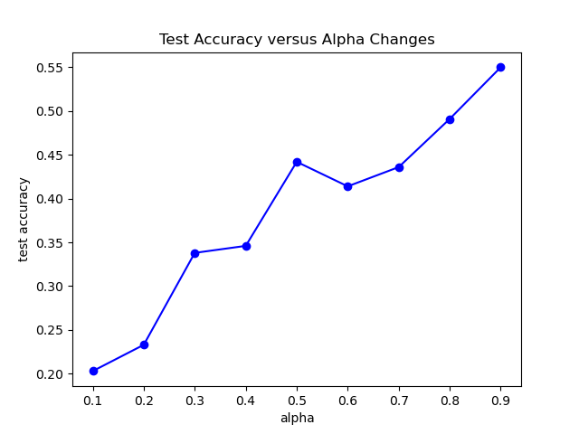
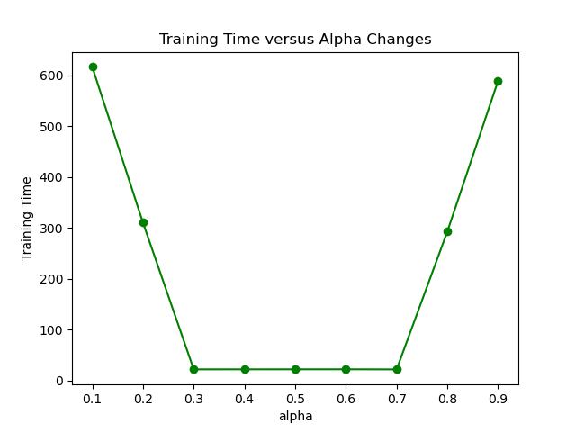
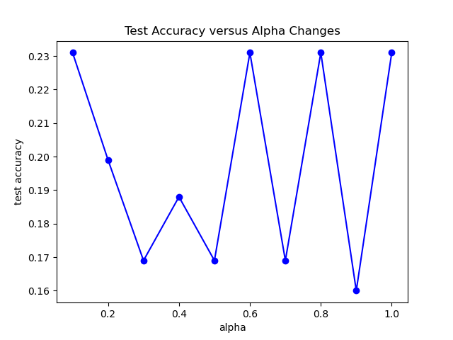
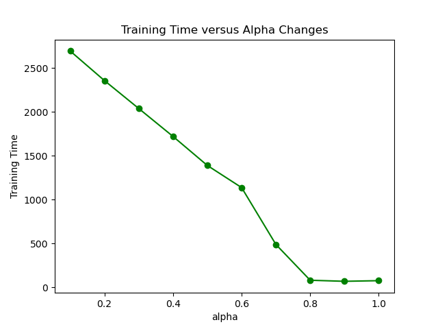

### GraphSnapShot

GraphSnapShot is a framework for fast storage, retrieval and computation for graph learning, developed by Shawn Dong Liu. It can quickly store and update the local topology of graph structure, just like take `snapshots` of the graph.


3 system design strategies


```
FBL: full batch load
OTF: partial cache refresh (on the fly) snapshot
FCR: full cache refresh snapshot
```

Deployment:

FBL implementation is same as the `MultiLayerSampler` implemented in dgl.

To deploy our projects, we can reach to the Samplers in SSDReS_Sampler by `cd SSDReS_Samplers`, and then find the following file
```
NeighborSampler_OTF_struct.py
NeighborSampler_OTF_nodes.py
NeighborSampler_FCR_struct.py
NeighborSampler_FCR_nodes.py
```

Add samplers code in SSDReS_Sampler into the neighbor_sampler.py in dgl as in the path above and save the changes.

```
cd ~/anaconda3/envs/dglsampler/lib/python3.9/site-packages/dgl/dataloading/neighbor_sampler.py
```
Then you can deploy OTF and FCR samplers at node-level and struct-level from neighbor_sampler and create objects of those samplers.

Two types of samplers:
```
node-level: split graph into graph_static and graph_dynamic, enhance the capability for CPU-GPU co-utilization.
structure-level: reduce the inefficiency of resample whole k-hop structure for each node, use static-presample and dynamic-resample for structure retrieval acceleration.
```

Downsteam Task: 
```
MultiLayer GCN
MultiLayer SGC
MultiLayer GraphSAGE
```

Datasets:
```
ogbn_arxiv - struct / nodes
ogbn_products - struct / nodes
ogbn_proteins - struct / nodes
FB-15K - nodes
```

<p align="center">
  
  
  
</p>

Design of FBL


Design of OTF


Design of FCR


Results

```
time = [252.6, 143.4, 107.8]  
memory = [20.3, 18.2, 22.5]  
accuracy = [71.3, 62.9, 67.5]  
posttrain_time = [0, 23.6, 82.5]  
```


The main idea of this framework is `Static Pre-Sampling and Dynamic Re-Sampling` for Efficient Graph Learning Storage and Retrieval.

Result Analysis

setting 1:

```Python
presampled_nodes = 20
presampled_perexpansion = 2
resampled_nodes = 10
sampled_depth = 1
mode = "tradeoff"
```


1. Test Loss versus Alpha Changes

   

2. Test Accuracy versus Alpha Changes

   

3. Training Time versus Alpha Changes

   

setting 2.1:

```Python
presampled_nodes = 20
presampled_perexpansion = 2
resampled_nodes = 10
sampled_depth = 2
mode = "sswp"
```


1. Test Loss versus Alpha Changes

   

2. Test Accuracy versus Alpha Changes

   

3. Training Time versus Alpha Changes

   

setting 2.2:

```Python
presampled_nodes = 20
presampled_perexpansion = 2
resampled_nodes = 10
sampled_depth = 2
mode = "dswp"
```


1. Test Loss versus Alpha Changes

   

2. Test Accuracy versus Alpha Changes

   

3. Training Time versus Alpha Changes

   

setting 2.3:

```Python
presampled_nodes = 20
presampled_perexpansion = 2
resampled_nodes = 10
sampled_depth = 2
mode = "cswp"
```


1. Test Loss versus Alpha Changes

   

2. Test Accuracy versus Alpha Changes

   

3. Training Time versus Alpha Changes

   

setting 3.1:

```Python
presampled_nodes = 20
presampled_perexpansion = 2
resampled_nodes = 10
sampled_depth = 3
mode = "sswp"
```


1. Test Loss versus Alpha Changes

   

2. Test Accuracy versus Alpha Changes

   

3. Training Time versus Alpha Changes

   

setting 3.2:

```Python
presampled_nodes = 20
presampled_perexpansion = 2
resampled_nodes = 10
sampled_depth = 3
mode = "dswp"
```


1. Test Loss versus Alpha Changes

   

2. Test Accuracy versus Alpha Changes

   

3. Training Time versus Alpha Changes

   

setting 3.3:

```Python
presampled_nodes = 20
presampled_perexpansion = 2
resampled_nodes = 10
sampled_depth = 3
mode = "cswp"
```


1. Test Loss versus Alpha Changes

   

2. Test Accuracy versus Alpha Changes

   

3. Training Time versus Alpha Changes

   


setting 3.1:

```Python
presampled_nodes = 20
presampled_perexpansion = 2
resampled_nodes = 10
sampled_depth = 4
mode = "sswp"
```


1. Test Loss versus Alpha Changes

   

2. Test Accuracy versus Alpha Changes

   

3. Training Time versus Alpha Changes

   

setting 3.2:

```Python
presampled_nodes = 20
presampled_perexpansion = 2
resampled_nodes = 10
sampled_depth = 4
mode = "dswp"
```


1. Test Loss versus Alpha Changes

   

2. Test Accuracy versus Alpha Changes

   

3. Training Time versus Alpha Changes

   

setting 3.3:

```Python
presampled_nodes = 20
presampled_perexpansion = 2
resampled_nodes = 10
sampled_depth = 4
mode = "cswp"
```


1. Test Loss versus Alpha Changes

   

2. Test Accuracy versus Alpha Changes

   

3. Training Time versus Alpha Changes

   